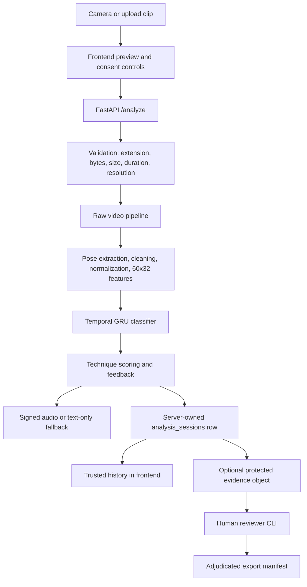

# Architecture

This project is designed as a layered AI coaching pipeline. Each layer does one clear job, and the output of one layer becomes the input for the next layer.

## 1. Video Input Layer

This layer receives a batting video from the user (recorded or uploaded).  
Its job is to validate the file format, store the original video safely, and pass the video location to the next step.

## 2. Pose Extraction Layer

This layer reads the video frame by frame and detects body keypoints (pose landmarks), such as shoulders, elbows, hips, knees, and wrists.  
The output is structured pose data over time instead of raw pixels.

## 3. Preprocessing Layer

Raw pose data can be noisy. This layer cleans it by handling missing points, smoothing unstable landmarks, and normalizing coordinates so different camera distances and body sizes are more comparable.

## 4. Feature Engineering Layer

This layer converts cleaned landmarks into useful motion features, such as joint angles, movement speed, bat swing direction, and body balance indicators.  
These features help the model understand cricket technique more clearly.

## 5. Sequence Model Layer

A sequence model analyzes the full time-series motion (not a single frame).  
It learns the complete batting pattern and predicts the most likely shot class for that motion sequence.

## 6. Shot Segmentation Layer

This layer identifies the start and end of a single swing and ensures the system produces exactly one final prediction for that swing.  
It prevents repeated predictions while the same motion is still in progress.

## 7. Technique Scoring Layer

After shot classification, this layer compares the user sequence with ideal or pro-player reference sequences.  
It computes a technique match percentage and highlights where timing, angles, or posture differ.

## 8. Feedback Engine

This layer converts technical differences into readable coaching guidance.  
It detects common mistakes and provides actionable suggestions (for example, stance correction, bat path adjustment, or follow-through improvement).

## 9. API Layer

The backend API exposes endpoints for video upload, inference execution, readiness, capabilities, feedback, product feedback, consent withdrawal, evidence deletion, and signed audio delivery.

It coordinates:

- upload validation;
- bounded analysis capacity;
- raw-video inference;
- model provenance;
- trusted server-side persistence;
- consented evidence retention;
- text/audio response formatting;
- feedback review eligibility.

## 10. Frontend Product Layer

The web app is now an active Smart Cricket workspace, not only a future integration target.

It supports:

- Supabase-backed authentication when configured;
- local demo mode when Supabase is absent;
- camera recording with countdown, timer, preview, retake, and upload fallback;
- model-improvement consent controls based on backend capabilities;
- prediction, confidence, technique score, quality state, timing, probabilities, coaching tips, and audio/text fallback;
- feedback collection bound to verified analysis sessions;
- trusted/local/demo history labels and filters.

The frontend must never claim that local rows are secure server history. Trusted history comes from backend-created `analysis_sessions` rows.

## 11. Feedback and Evidence Governance Layer

User feedback is not ground truth. It becomes a review candidate only when:

- the user is authenticated;
- the feedback is bound to a verified server analysis;
- model-improvement participation is enabled;
- the user gave consent;
- protected evidence was retained before analysis;
- evidence has not expired, been withdrawn, or been deleted.

General usability, bug, and feature feedback is stored separately in `product_feedback` and never enters ML-training workflows.

## 12. Release-Gate Layer

Production claims require evidence outside the current codebase:

- legal real raw-video fixture for Phase 12 E2E;
- live Supabase auth, RLS, persistence, and private Storage verification;
- production hosting, TLS, CORS, secrets, and monitoring;
- larger consented dataset with player/group IDs;
- player-held-out calibration and evaluation reports;
- coach review of labels and advice safety;
- privacy/legal approval for consent, retention, deletion, and incident response.

## End-to-End Data Flow

1. User uploads batting video to the system.
2. Video Input Layer validates and stores the file.
3. Pose Extraction Layer converts video frames into landmarks.
4. Preprocessing Layer cleans and normalizes landmarks.
5. Feature Engineering Layer creates motion-aware features.
6. Shot Segmentation Layer isolates one complete swing.
7. Sequence Model Layer predicts one final shot label.
8. Technique Scoring Layer computes match percentage vs references.
9. Feedback Engine generates mistake analysis and coaching advice.
10. API Layer returns prediction, score, feedback, provenance, quality state, audio state, persistence state, and optional evidence-retention state.
11. Backend persists trusted analysis history when authenticated server-side persistence is configured.
12. Frontend displays trusted rows as server-saved and local/demo rows as untrusted.
13. User feedback is saved as metadata or a human-review candidate depending on consent and retained evidence.

## Current Production-Hardened Data Flow

## Current Release Verdict

Smart Cricket is a restricted internal beta candidate after PR #3 is green and reviewed. It is not public production-ready until the external release gates are satisfied.
