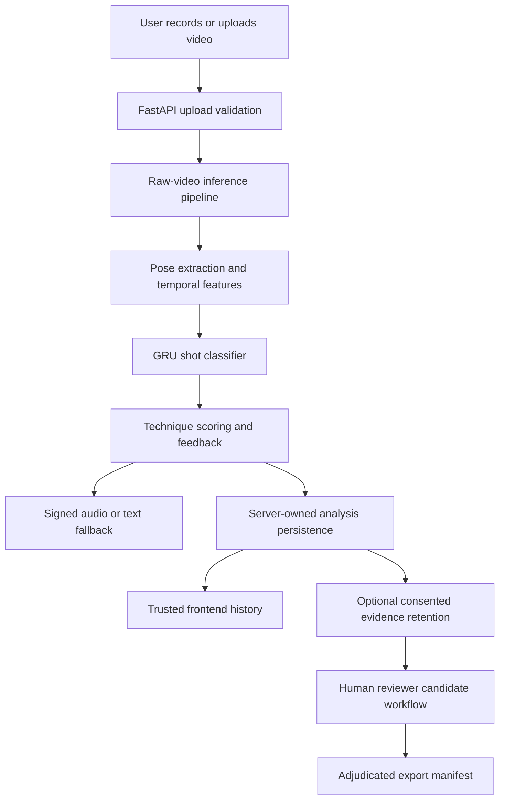

# 15.7 Final Architecture Current State and Release Gates

## Current State

Smart Cricket is close to a restricted internal beta. It is not public production-ready because the remaining blockers require real-world evidence, credentials, deployment, and expert validation.

## Current Architecture

## Ready for Restricted Internal Beta When

- PR #3 is green and reviewed;
- PR #3 is merged into `production-hardening`;
- the app is run in a controlled internal environment;
- users understand the model limitations;
- feedback is treated as beta evidence only.

## Not Ready for Public Production Until

- a legal raw batting fixture passes Phase 12 E2E;
- Supabase auth, RLS, persistence, and private storage are verified live;
- production hosting, TLS, CORS, secrets, and monitoring are configured;
- a larger consented dataset exists with player IDs;
- player-held-out calibration/evaluation passes;
- coach validation approves labels and advice safety;
- privacy/legal review approves consent, retention, deletion, and incident response.

## Merge Decision

PR #3 can become ready for merge into `production-hardening` after its latest CI passes. PR #2 should not merge into `main` until PR #3 is integrated and the external release gates are understood.

## Interview Implications

Short answer: the project is defensible because it separates engineering readiness from ML validity.

Deep answer: A product can be well engineered while still blocked from production ML claims. Smart Cricket now has the architecture, tests, and documentation to support a controlled beta, but real-world model validity needs external evidence.
